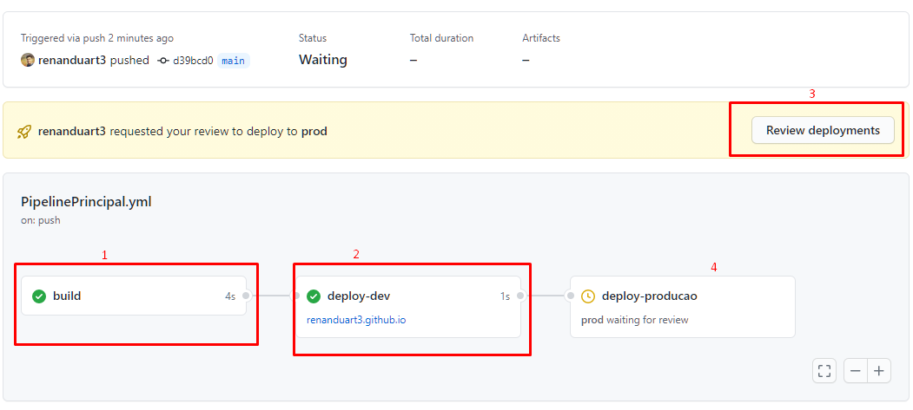

# integracao-continua-exemplo

### Pipelines com ambientes no GitHub

Ambientes criados e referenciados no pipeline:
  - dev
  - prod

### Configuração do Pipiline

### Ao Rodar o pipeline
  Trigger:
    Ao evento de push na main
    Ao evento de pull request na main
    Ao acionar manualmente o pipeline (opção disponivel atraves do dispatch no pipeline)
    

1 - Job de build
2 - Job de deploy após a etapa de build
3 - Para deploy no ambiente de produção requer aprovação (opção disponivel ao criar os ambientes na configuração de repositorio no github)
4 - Job de deploy no ambiente de produção após rodar o Job em dev com sucesso e após review do autorizador

